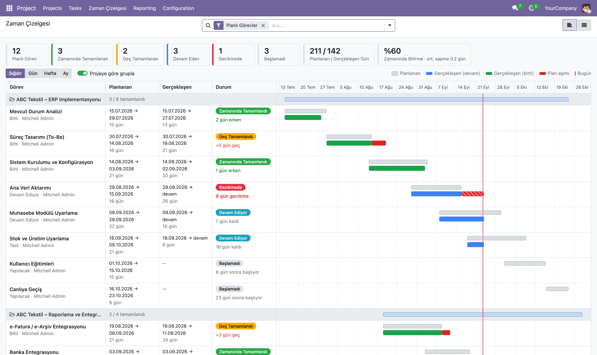

# Proje - Plan / Gerçekleşen Takibi (Odoo 19)

Proje görevlerini plan / gerçekleşen bazında takip etmek için Proje uygulamasına eklenti.
ERP implementasyonu, kurulum, danışmanlık, yazılım geliştirme gibi tarih planlı her türlü projede kullanılabilir.

## Özellikler

- **Görev formu → "Plan Takibi" sekmesi**
  - Planlanan Başlangıç / Planlanan Bitiş (elle girilir)
  - Gerçek Başlangıç (isteğe bağlı; boşsa planlanan başlangıç kullanılır)
  - Tamamlanma Tarihi: görev tamamlanma aşamasına alındığında (veya durumu "Bitti" yapıldığında)
    otomatik yazılır, görev yeniden açılırsa temizlenir. Elle düzeltilebilir.
  - Planlanan süre, gerçekleşen süre, sapma (gün) ve plan durumu
- **Aşama ayarı → "Tamamlanma Aşaması"**: varsayılan olarak "Kanban'da katlanmış" aşamalar işaretlidir,
  istenirse aşama formundan değiştirilebilir.
- **Zaman Çizelgesi görünümü** (yeni görünüm tipi: `plan_timeline`)
  - Her görev için gri bar = planlanan süre, renkli bar = gerçekleşen süre
    (mavi: devam ediyor, yeşil: tamamlandı, kırmızı: plan aşımı; çizgili kırmızı: hâlâ devam eden gecikme)
  - Bugün çizgisi, proje bazında gruplama, Sığdır / Gün / Hafta / Ay ölçekleri
  - Üstte özet: zamanında / geç tamamlanan, devam eden, gecikmede, toplam planlanan-gerçekleşen gün,
    zamanında bitirme oranı ve ortalama sapma
  - Satıra tıklayınca görev formu açılır; arama çubuğundaki tüm filtreler çalışır
- Liste görünümüne isteğe bağlı plan sütunları, arama görünümüne plan filtreleri.

## Erişim

- Proje → **Zaman Çizelgesi** menüsü
- Bir projenin görevlerini açtığınızda görünüm değiştiricide de bulunur.

## Kurulum

1. `project_plan_timeline` klasörünü addons yolunuza kopyalayın.
2. Uygulamalar → Uygulama Listesini Güncelle → "Plan / Gerçekleşen Takibi" → Kur.

> Not: `project` / `project_enterprise` modülleri güncellendiğinde standart görev eylemlerinin görünüm listesi
> sıfırlanabilir. Bu durumda bu modülü de güncelleyin (görünüm tekrar eklenir).
> "Zaman Çizelgesi" menüsü bundan etkilenmez.

## Teknik

| Alan | Açıklama |
|---|---|
| `schedule_date_start` / `schedule_date_end` | Planlanan başlangıç / bitiş |
| `schedule_actual_start` | Gerçek başlangıç (isteğe bağlı) |
| `schedule_date_done` | Tamamlanma tarihi (otomatik, düzenlenebilir) |
| `schedule_planned_days` / `schedule_actual_days` / `schedule_delay_days` | Süre ve sapma (gün) |
| `schedule_status` | Plan durumu |
| `project.task.type.schedule_is_done_stage` | Tamamlanma aşaması işareti |
